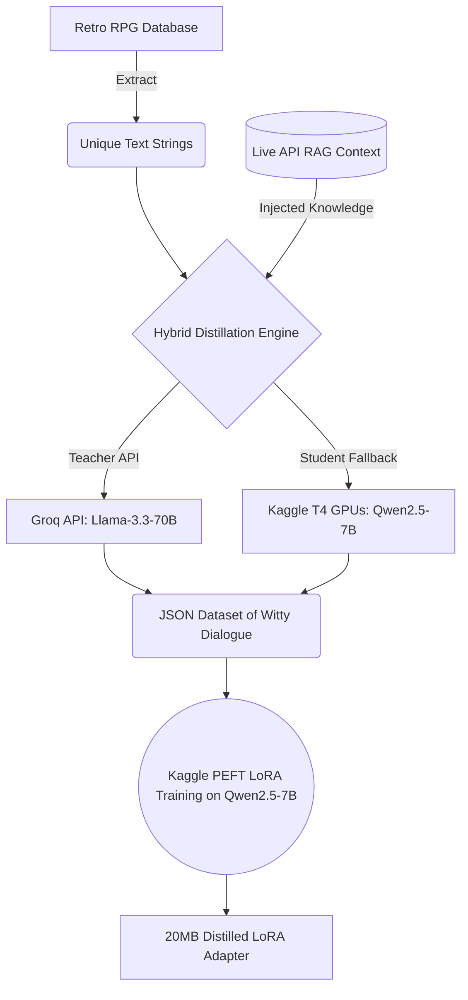
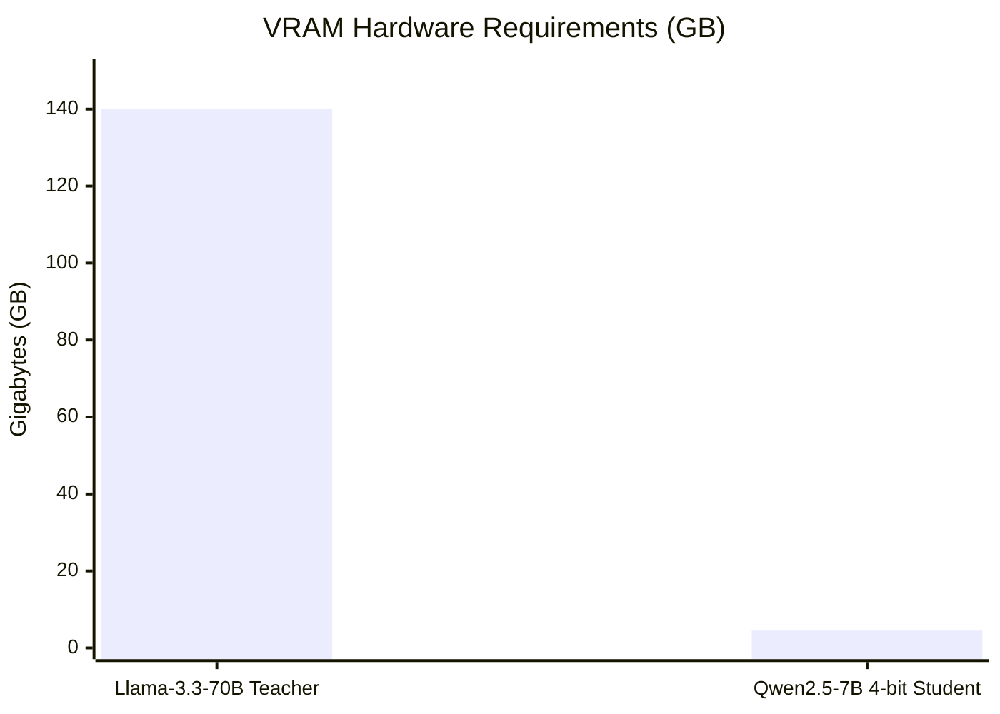

# AI Distillation: Teaching Qwen2.5-7B via Llama-3.3-70B

This repository contains a standalone, Kaggle-ready Jupyter Notebook demonstrating **Knowledge Distillation**. We use a massive teacher model (Llama-3.3-70B) to train a lightweight, lightning-fast student model (Qwen2.5-7B) using LoRA (Low-Rank Adaptation).

As a fun **example use-case**, this pipeline is configured to rewrite retro RPG dialogue (specifically from a popular 90s monster-catching game) to generate witty, context-aware NPC interactions. However, this Hybrid RAG + Distillation architecture can be applied to *any* domain where you need 70B-level reasoning at a fraction of the cost!

## 🧠 Distillation Architecture

The entire process is fully automated. We use a hybrid generation approach to ensure we never hit rate limits. If the API throttles the Teacher model, we instantly load the Student model into memory to continue generating synthetic data locally.



## 📊 The Technical Feat: Extreme Efficiency

By distilling the high-level reasoning of a 70B model into a 7B model via PEFT LoRA, we achieve massive architectural savings. It drops the barrier to entry from enterprise-grade server racks down to consumer hardware.

### Efficiency Comparison

| Metric | Teacher (Llama-3.3-70B) | Student (Qwen2.5-7B LoRA) | Reduction Savings |
|---|---|---|---|
| **Parameters** | 70 Billion | 7 Billion | **10x Smaller** |
| **VRAM Required** | ~140 GB | ~4.5 GB | **31x Less Memory** |
| **Storage Space** | ~130 GB Base Model | 20 MB LoRA Adapter | **6,500x Less Storage** |
| **Inference Cost** | High (Cloud APIs) | $0.00 (Local Hardware) | **100% Free** |
| **Latency** | Heavy Multi-Second | Near-Instantaneous | **Real-Time Execution** |

### VRAM Requirements Graph



---

## 🚀 How to Run on Kaggle

This pipeline is specifically engineered to run in the free Kaggle dual T4 GPU environment. It features a robust **Hybrid API/Local Fallback** mechanism, guaranteeing that you never hit API rate limits or stop generating!

1. Fork this repository or download `kaggle_training_pipeline.ipynb` and `text_database.json`.
2. Open [Kaggle](https://www.kaggle.com/) and create a new Notebook.
3. Select **File > Import Notebook** and upload `kaggle_training_pipeline.ipynb`.
4. Upload `text_database.json` to your Kaggle Notebook's `/kaggle/input` directory.
5. In your Kaggle settings, add a new Secret named `GROQ_API_KEY` with your free [Groq API Key](https://console.groq.com/keys).
6. Click **Run All**!

---

## 🔍 Pipeline Deep Dive (Exact Code Blocks)

### 1. Retrieval-Augmented Generation (RAG)
Before the AI generates a response, we parse the source text to extract key entities. In our example, we query a live API (`PokeAPI`) to fetch specific elemental typings, injecting extreme contextual accuracy into the prompt.

```python
import requests
import json
import re

def get_entity_context(entity_name):
    try:
        res = requests.get(f"https://pokeapi.co/api/v2/pokemon/{entity_name.lower()}")
        if res.status_code == 200:
            types = [t["type"]["name"] for t in res.json()["types"]]
            return " and ".join(types)
    except:
        pass
    return None

def inject_rag_context(text):
    entity_mentions = re.findall(r'\b([A-Z]{3,})\b', text)
    context = []
    for entity in entity_mentions:
        etype = get_entity_context(entity)
        if etype:
            context.append(f"{entity} is a {etype} type.")
    return " ".join(context)
```

### 2. Hybrid Distillation (Llama-3 Teacher -> Qwen2.5 Fallback)
We iterate over our dataset and attempt to call the Groq API to utilize the massive **Llama-3.3-70B**. If Groq rate limits us, the pipeline seamlessly loads **Qwen2.5-7B** directly into the Kaggle GPU memory and continues generating the synthetic dataset locally!

```python
import os
from groq import Groq
import torch
from transformers import AutoModelForCausalLM, AutoTokenizer
from kaggle_secrets import UserSecretsClient

client = Groq(api_key=UserSecretsClient().get_secret("GROQ_API_KEY"))

fallback_model_id = "Qwen/Qwen2.5-7B-Instruct"
tokenizer = None
fallback_model = None

dataset = []

for item in list(game_texts.items()):
    address, original_text = item
    rag_context = inject_rag_context(original_text)
    prompt = f"Rewrite this text to be funny and sarcastic. Original: {original_text}\nContext: {rag_context}"
    
    try:
        # 1. Try Groq API (Teacher Model)
        chat = client.chat.completions.create(
            messages=[{"role": "user", "content": prompt}],
            model="llama-3.3-70b-versatile"
        )
        response = chat.choices[0].message.content
    except Exception as e:
        print("Groq rate limit hit. Falling back to local Qwen2.5-7B on T4 GPUs...")
        # 2. Local Fallback
        if fallback_model is None:
            tokenizer = AutoTokenizer.from_pretrained(fallback_model_id)
            fallback_model = AutoModelForCausalLM.from_pretrained(
                fallback_model_id, device_map="auto", torch_dtype=torch.float16
            )
        
        inputs = tokenizer(prompt, return_tensors="pt").to("cuda")
        outputs = fallback_model.generate(**inputs, max_new_tokens=50)
        response = tokenizer.decode(outputs[0], skip_special_tokens=True).replace(prompt, "").strip()
        
    dataset.append({"input": original_text, "output": response})

with open("distilled_dataset.json", "w") as f:
    json.dump(dataset, f)
```

### 3. PEFT LoRA Fine-Tuning (Student Model)
Using `SFTTrainer`, we train our `Qwen2.5-7B` student model on the newly generated dataset. This teaches the fast, local model how to replicate the comedy and high-level reasoning of the 70B teacher model.

```python
from datasets import load_dataset
from peft import LoraConfig, get_peft_model
from transformers import TrainingArguments, BitsAndBytesConfig
from trl import SFTTrainer

data = load_dataset("json", data_files="distilled_dataset.json", split="train")

def format_prompt(example):
    return f"<|im_start|>user\nRewrite this text: {example['input']}<|im_end|>\n<|im_start|>assistant\n{example['output']}<|im_end|>"

# Load the student model in 4-bit quantization to save massive VRAM
bnb_config = BitsAndBytesConfig(load_in_4bit=True, bnb_4bit_compute_dtype=torch.float16)
model = AutoModelForCausalLM.from_pretrained("Qwen/Qwen2.5-7B-Instruct", quantization_config=bnb_config, device_map="auto")

# Configure the LoRA Adapter
lora_config = LoraConfig(
    r=16, lora_alpha=32, target_modules=["q_proj", "v_proj"], 
    lora_dropout=0.05, bias="none", task_type="CAUSAL_LM"
)
model = get_peft_model(model, lora_config)

trainer = SFTTrainer(
    model=model,
    train_dataset=data,
    formatting_func=format_prompt,
    args=TrainingArguments(
        output_dir="distilled_adapter",
        per_device_train_batch_size=4,
        gradient_accumulation_steps=4,
        max_steps=500,
        learning_rate=2e-4,
        fp16=True
    )
)
trainer.train()

# The resulting weights are extremely efficient!
trainer.model.save_pretrained("distilled_adapter")
```
